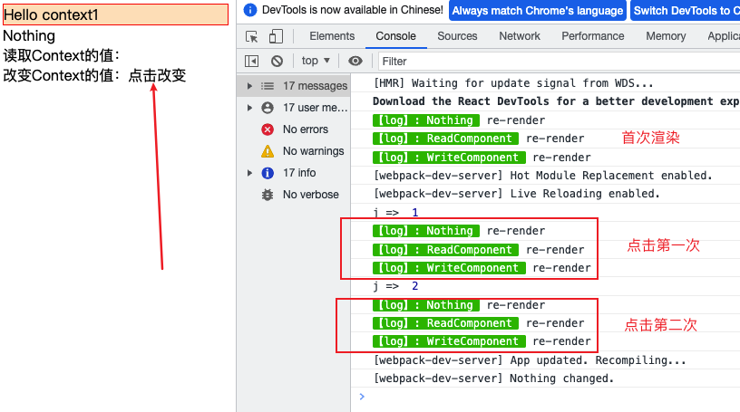
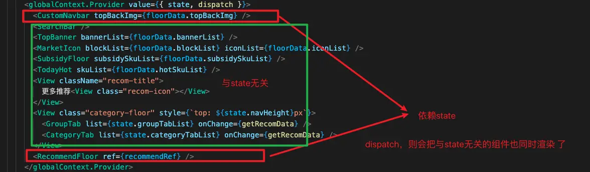
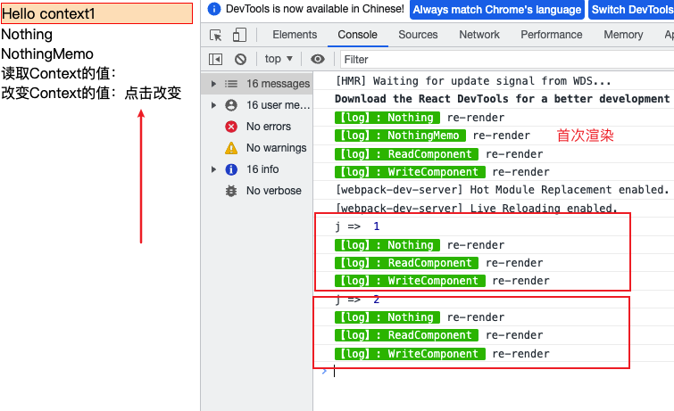
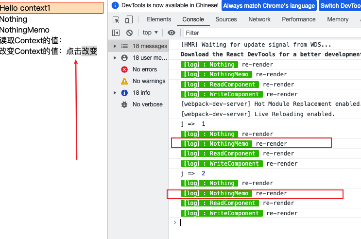
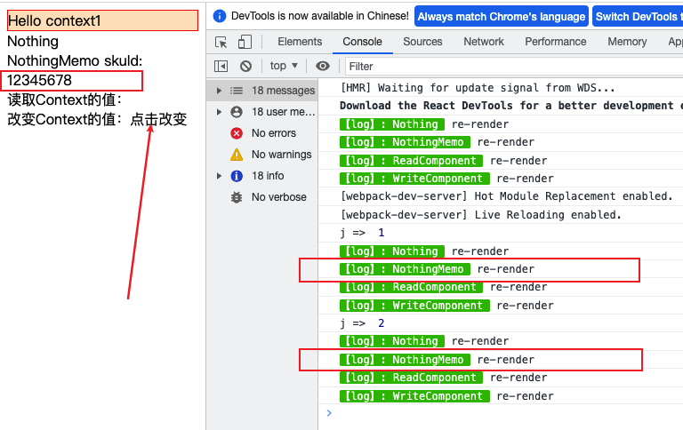

# useContext 重渲染问题

> 注：本文不会介绍 useContext 和 useReducer 怎么使用，如读者对这两个的使用还有疑惑，可以移步[React 官网](https://zh-hans.reactjs.org/)，以下更多的是从实践中得到的经验

## 基本概念

官方中文文档：

https://zh-hans.reactjs.org/docs/context.html

https://zh-hans.reactjs.org/docs/hooks-reference.html#usecontext

context 的出现就是为了处理多层级组件之间更容易通信的问题，避免数据通过 props 属性一直在组件间自上而下（由父及子）进行传递出现的繁琐场景， 如果你遇到一下场景，那么就适合使用 useContext 结合 useReducer 来处理：

1. 数据较多，复杂，页面展示依赖状态改变

   举例：

   假如你有一组数据，在用户访问当前页面的期间有可能被实时改变，而页面有较多地方，都要去获取它实时改变状态，那么我们不可能每一层组件以 props 的方式一个一个自上而下的去传递，这个时候就适合使用 context

2. 组件层级较深

   举例：

   有一个 token 参数，需要在页面中，每一处跳转的时候，携带，而跳转的地方分布在各个组件

## 项目初期

我之前使用过 Vue，所以对于页面共享数据，习惯的思维就是，这个数据是整一个页面共享的，也就是全局数据，于是我们写这样的例子

### context.ts

```javascript
import { createContext, useContext } from "react";

// 全局数据
class globalStore {
  i = 0;
  token = "";
  loading = true;
  canvasConfig = [];
  showQuestionLayer = false;
  showRule = false;
  posterPopup = {
    show: false,
    imgUrl: "",
  };
  userInfoData = {
    isShowLayer: false,
  };
  isError = false;
}

const globalContext = createContext(null);
const useGlobalContext = () => useContext(globalContext);

export { globalContext, globalStore, useGlobalContext };
```

### reducer.ts

组件中一旦 dispatch，就会引起 state 更新（引用地址变化），进而触发 `globalContext.Provider`组件上 value 的更新，组件树重新渲染

```javascript
/**
 * 全局的 Reducer
 */
function pageReducer(state: any, action: { type: any, payload: any }) {
  switch (action.type) {
    case "__setStore":
      state = Object.assign(state, action.payload);
      break;
    default:
      console.error("reducer error", action);
      return state;
  }
  return { ...state };
}

export default pageReducer;
```

### index.ts

这里我们就利用`useContext`和`useReducer`初步实现了一个不同层级组件间，共用一份数据的方案

其中`ReadComponent`为获取全局数据的组件，`WriteComponent`为做 dispatch 操作的组件，而`Nothing`组件什么都不做，是普通组件

```javascript
import React, { useReducer } from "react";
import ReactDOM from "react-dom/client";
import { Nothing, ReadComponent, WriteComponent } from "./components/index";
import { globalStore, globalContext } from "./context";
import pageReducer from "./reducer";
import "./index.scss";

function Index(): React.ReactElement {
  const [state, dispatch] = useReducer(pageReducer, new globalStore());

  return (
    <globalContext.Provider value={{ state, dispatch }}>
      <div className="page">Hello context1</div>
      <Nothing />
      <ReadComponent />
      <WriteComponent />
    </globalContext.Provider>
  );
}

const root = ReactDOM.createRoot(document.getElementById("root"));
root.render(<Index />);
```

注意到以下三个组件都有日志打印

```javascript
// ReadComponent
import { useGlobalContext } from '../../context';
import { log } from '@common/utils';
import React from 'react';

export default function ReadComponent() {
    log.info('ReadComponent', 're-render');
    const state = useGlobalContext();
    return <div>读取Context的值：{state && state.i}</div>;
}

// WriteComponent
import React from 'react';
import { useGlobalContext } from '../../context';
import { log } from '@common/utils';

let j = 0;

export default function WriteComponent() {
    log.info('WriteComponent', 're-render');

    const { dispatch } = useGlobalContext();
    const changeContext = () => {
        dispatch({
            type: '__setStore',
            payload: {
                i: ++j,
            },
        });
        console.log('j => ', j);
    };

    return (
        <div>
            改变Context的值：
            <a className="App-link" onClick={changeContext}>
                点击改变
            </a>
        </div>
    );
}

// Nothing
import React from 'react';
import { log } from '@common/utils';

export default function Nothing() {
    log.info('Nothing', 're-render');
    return <div>Nothing</div>;
}

```

一切似乎都可以正常工作，开发组件也没有问题，所以我们不断的往`globalContext.Provider`里面加组件，这个时候你肯定会想，为啥要往`globalContext.Provider`加组件？不是一般用到全局数据的组件才往里面加吗？不然每一次 value 的值更新，就会导致里面所有的组件重新渲染，如下图所示



我们点击改变，组件`Nothing`并没有去读取`globalContext.Provider`提供的 value，也同样重新渲染了，这意味着，只要 value 变化，Provider 里面的子组件都会重新渲染

官网提到：

> 当组件上层最近的 `<MyContext.Provider>` 更新时，该 Hook 会触发重渲染，并使用最新传递给 `MyContext` provider 的 context `value` 值。即使祖先使用 [`React.memo`](https://zh-hans.reactjs.org/docs/react-api.html#reactmemo) 或 [`shouldComponentUpdate`](https://zh-hans.reactjs.org/docs/react-component.html#shouldcomponentupdate)，也会在组件本身使用 `useContext` 时重新渲染。

确实是这样，但是有没有思考一个问题，我的页面布局依赖组件的编排，要是把无需全局 state 数据的组件移到 Provider 外面，就会影响页面编排，即以下图片所示问题，这个时候我还要考虑，`怎么去拆分不会更改和读取到全局state数据的组件？`



## 使用`React.memo`来优化

### 无副作用

明白 memo 的作用后，我们使用 memo 来优化组件渲染问题，我们新增一个`NothingMemo`组件，如下：

```javascript
import React from "react";
import { log } from "@common/utils";

function NothingMemo() {
  log.info("NothingMemo", "re-render");

  return <div>NothingMemo</div>;
}

export default React.memo(NothingMemo);
```

点击改变，看控制台



我们可以看到，在点击改变按钮时，`NothingMemo`组件就不会重新渲染了

### 写入操作

那假如我们`NothingMemo`组件会 dispatch 去改变全局数据呢？如下：

```javascript
import React from 'react';
import { log } from '@common/utils';
+ import { useGlobalContext } from '../../context';

function NothingMemo() {
    log.info('NothingMemo', 're-render');
+    const { dispatch } = useGlobalContext();

    return <div>NothingMemo</div>;
}

export default React.memo(NothingMemo);

```

依然会重新渲染，因为 dispatch 函数是塞在 Provider 上的 value 中，value 引用地址改变，当然会重新渲染组件，这是肯定的



### 比较回调

那么我们这时候想着，如果我们给 memo 加上一个比较函数，也就是 memo 的第二次参数

```javascript
import React from 'react';
import { log } from '@common/utils';
import { useGlobalContext } from '../../context';

function NothingMemo(props) {
    log.info('NothingMemo', 're-render');
+    const { skuId } = props;
    const { dispatch } = useGlobalContext();

+    return <div>NothingMemo skuId: {skuId}</div>;
}

+ export default React.memo(NothingMemo, (preProps, nextProps) => {
+     if (preProps.skuId != nextProps.skuId) {
+         return false;
+     }
+    return true;
});

 // 首页代码（截取一部分）
  function Index(): React.ReactElement {
    const [state, dispatch] = useReducer(pageReducer, new globalStore());

    return (
        <globalContext.Provider value={{ state, dispatch }}>
            <div className="page">Hello context1</div>
            <Nothing />
 +           <NothingMemo skuId="12345678" />
            <ReadComponent />
            <WriteComponent />
        </globalContext.Provider>
    );
}

const root = ReactDOM.createRoot(document.getElementById('root'));
root.render(<Index />);

```

我们增加了 memo 的比较函数，函数中代码的意思也就是当 props 中的 skuId 变化了，我们才重新渲染组件，我们来看实际效果，如下：



注意，我们并没有去改变 skuId，但是实际效果，依然重新渲染了，所以这种优化不严谨

## 使用 useMemo 来优化

这里在 Provider 新增了`NothingUseMemo`子组件，同样以上面的方式验证，这里贴出代码，具体就不验证了，这里没什么特殊的，也就是和 useMemo 的用法一样，useMemo 内部会根据依赖项的变化而变化，而 useMemo 外部则不可避免的会重新渲染

```javascript
function NothingUseMemo(props: { skuId: any }) {
    log.info('NothingUseMemo', 're-render');
+    const { skuId } = props;

+    return React.useMemo(() => {
+  			log.info('NothingUseMemo', 'useMemo re-render');
        return <div>NothingUseMemo {skuId}</div>;
+    }, [skuId]);
}

export default NothingUseMemo;
```

## 总结

## React.memo

官方文档：https://zh-hans.reactjs.org/docs/react-api.html#reactmemo

- Memo 仅检查 props 变更
- 默认情况下其只会对复杂对象做浅层对比
- 仅作为**[性能优化](https://zh-hans.reactjs.org/docs/optimizing-performance.html)**的方式而存在。但请不要依赖它来“阻止”渲染

## 参考文章

[如何优雅地处理使用 React Context 导致的不必要渲染问题？](https://zhihu.com/question/450047614)

[Preventing rerenders with React.memo and useContext hook](https://github.com/facebook/react/issues/15156)

[我在工作中写 React，学到了什么？性能优化篇](https://juejin.cn/post/6889247428797530126)
